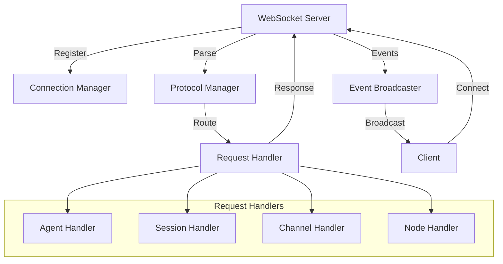
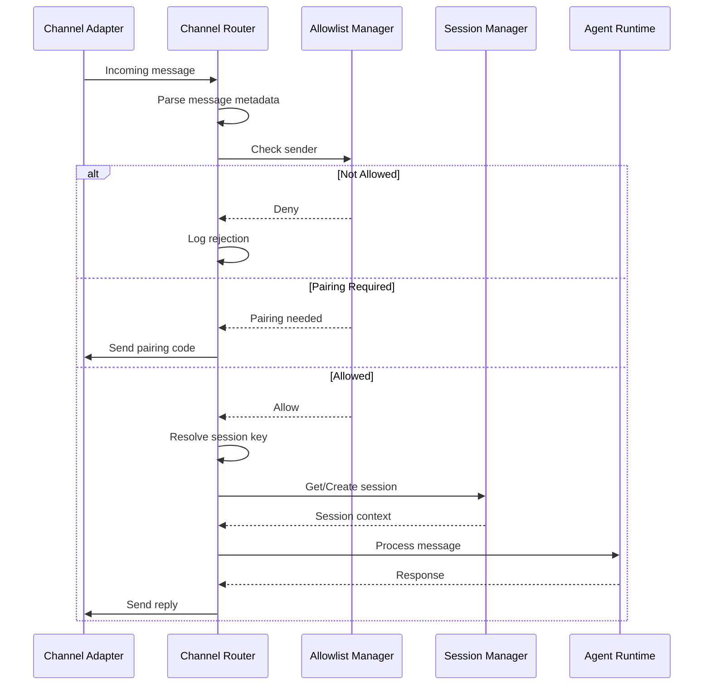
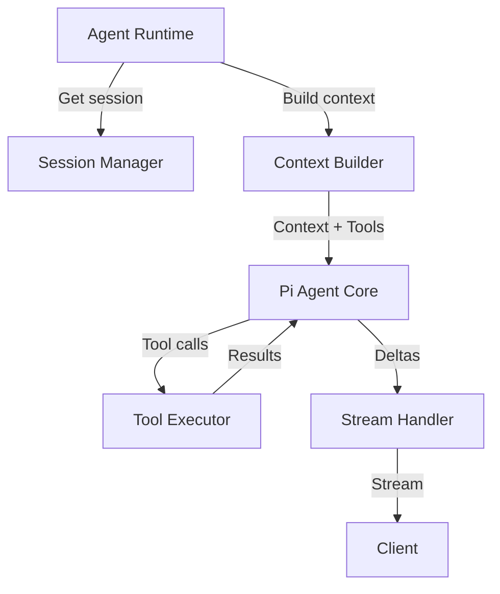
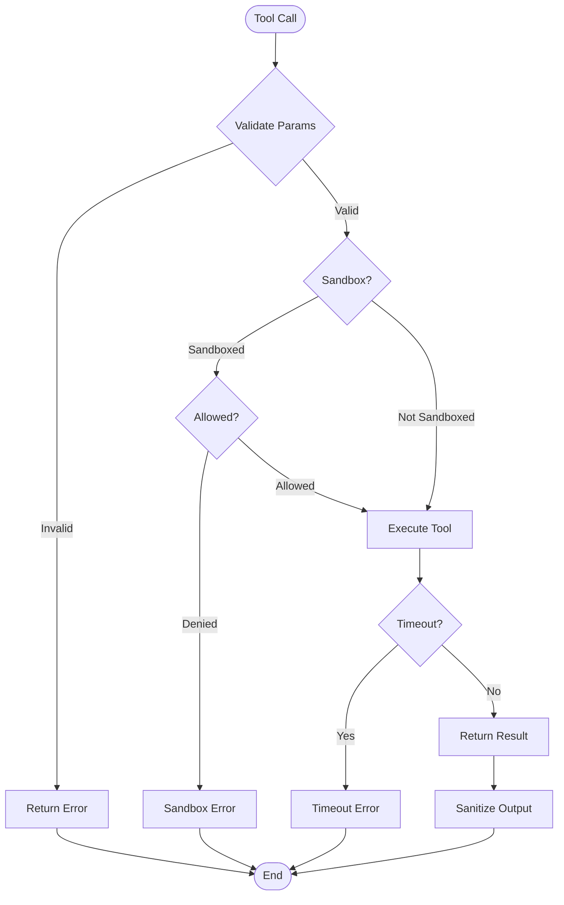
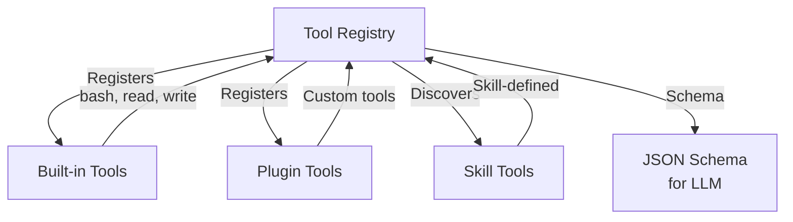
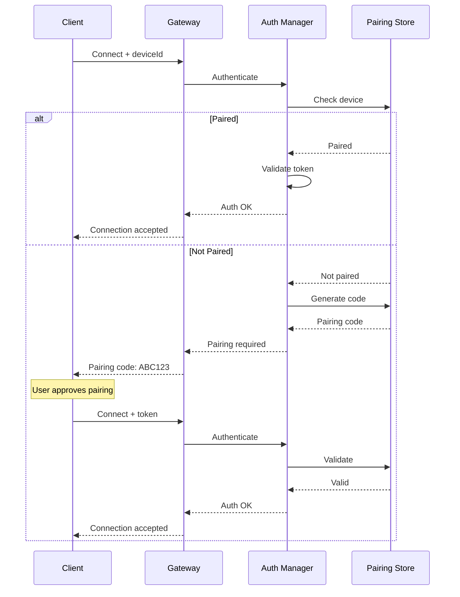

# OpenClaw Component Interaction Documentation

## Table of Contents
1. [Component Overview](#component-overview)
2. [Gateway Server](#gateway-server)
3. [Channel System](#channel-system)
4. [Agent Runtime](#agent-runtime)
5. [Session Management](#session-management)
6. [Plugin System](#plugin-system)
7. [Device Nodes](#device-nodes)
8. [Security Components](#security-components)

---

## Component Overview

### Component Hierarchy

```
OpenClaw System
├── Gateway (Control Plane)
│   ├── WebSocket Server
│   │   ├── Connection Manager
│   │   ├── Message Router
│   │   └── Protocol Handler
│   ├── Session Management
│   │   ├── Session Store
│   │   ├── Context Builder
│   │   └── Compaction Engine
│   ├── Agent Runtime
│   │   ├── Pi Agent Core
│   │   ├── Tool Executor
│   │   └── Stream Handler
│   ├── Channel Manager
│   │   ├── Channel Router
│   │   ├── Allowlist Manager
│   │   └── Message Normalizer
│   ├── Plugin System
│   │   ├── Plugin Loader
│   │   ├── Hook Dispatcher
│   │   └── Tool Registry
│   └── Security
│       ├── Auth Manager
│       ├── Pairing System
│       └── Sandbox Manager
├── Channels (Adapters)
│   ├── WhatsApp (Baileys)
│   ├── Telegram (grammY)
│   ├── Slack (Bolt)
│   ├── Discord (discord.js)
│   ├── Signal (signal-cli)
│   └── iMessage (native)
├── Device Nodes
│   ├── macOS Node
│   ├── iOS Node
│   └── Android Node
└── External Services
    ├── LLM Providers (Anthropic, OpenAI)
    └── Push Services (APNs, FCM)
```

---

## Gateway Server

### WebSocket Server

The WebSocket server is the central communication hub for all clients.

#### Responsibilities
- Accept and manage WebSocket connections
- Handle protocol handshake
- Route messages to appropriate handlers
- Broadcast events to connected clients
- Manage connection lifecycle

#### Interactions



#### Key Files
- `src/gateway/server.ts` - Entry point
- `src/gateway/server.impl.ts` - Implementation
- `src/gateway/client.ts` - Client connection handling
- `src/gateway/server-methods.ts` - RPC method handlers
- `src/gateway/server-methods-list.ts` - Method registry

---

## Channel System

### Channel Architecture

Channels provide a unified interface for different messaging platforms.

#### Channel Interface

```typescript
interface ChannelAdapter {
  // Lifecycle
  initialize(config: ChannelConfig): Promise<void>;
  start(): Promise<void>;
  stop(): Promise<void>;
  
  // Messaging
  send(message: OutboundMessage): Promise<SendResult>;
  onMessage(handler: (message: InboundMessage) => void): void;
  
  // Status
  getStatus(): ChannelStatus;
  healthCheck(): Promise<HealthStatus>;
}
```

### Channel Router

Routes incoming messages to appropriate sessions and handles allowlists.

#### Flow



#### Key Components

| Component | Location | Responsibility |
|-----------|----------|----------------|
| Channel Manager | `src/channels/` | Channel lifecycle management |
| Channel Router | `src/routing/` | Message routing logic |
| Allowlist Manager | `src/channels/allowlists/` | Access control |
| Message Normalizer | `src/channels/plugins/normalize/` | Normalize message format |

### WhatsApp Channel

Uses Baileys library for WhatsApp Web integration.

```typescript
// Key features
- QR code authentication
- Multi-device support
- Group message handling
- Media download/upload
- Presence updates
```

#### Files
- `src/whatsapp/` - WhatsApp implementation
- `src/whatsapp/bailey.ts` - Baileys integration

### Telegram Channel

Uses grammY framework for Telegram Bot API.

```typescript
// Key features
- Bot API via polling or webhook
- Group and channel support
- Inline keyboards
- File handling (photos, documents)
```

#### Files
- `src/telegram/` - Telegram implementation

### Slack Channel

Uses Bolt framework for Slack apps.

```typescript
// Key features
- Socket Mode support
- Block Kit UI
- Slash commands
- Home tab
```

#### Files
- `src/slack/` - Slack implementation

### Discord Channel

Uses discord.js library.

```typescript
// Key features
- Gateway connection
- DM and guild support
- Embeds and reactions
- Voice channel (optional)
```

#### Files
- `src/discord/` - Discord implementation

---

## Agent Runtime

### Pi Agent Core Integration

The agent runtime wraps pi-agent-core for AI execution.

#### Architecture



### Context Builder

Builds the system prompt and conversation context.

#### Components

```
Context Builder
├── System Prompt
│   ├── Base Instructions
│   ├── Tool Descriptions
│   ├── Skills List
│   ├── Workspace Info
│   └── Time/Runtime Info
├── Conversation History
│   ├── Recent Messages
│   ├── Compaction Summary
│   └── Tool Results
└── Bootstrap Files
    ├── AGENTS.md
    ├── SOUL.md
    ├── TOOLS.md
    └── SKILL.md files
```

#### Key Files
- `src/agents/` - Agent runtime
- `src/agents/pi-embedded-runner/` - Pi integration
- `src/agents/schema/` - Tool schemas

### Tool Executor

Manages tool execution with sandboxing support.

#### Tool Types

| Category | Tools | Sandbox |
|----------|-------|---------|
| File Operations | read, write, edit | Allowed in sandbox |
| Process | bash, process | Allowed in sandbox |
| Browser | browser | Denied in sandbox |
| Nodes | node.invoke | Denied in sandbox |
| System | system.* | N/A (macOS only) |

#### Execution Flow



---

## Session Management

### Session Store

Manages persistence of conversation history.

#### Storage Format

```javascript
// Session file: ~/.openclaw/sessions/<session-id>.jsonl

// Line 1: Metadata
{"type": "metadata", "createdAt": "2026-01-31T12:00:00Z", "agentId": "default"}

// Line 2+: Messages
{"type": "system", "content": "System prompt...", "timestamp": "..."}
{"type": "user", "content": "Hello", "timestamp": "..."}
{"type": "assistant", "content": "Hi!", "timestamp": "..."}
{"type": "tool", "tool": "bash", "result": "...", "timestamp": "..."}
```

#### Session Key Resolution

```
Session Key Format: <channel>:<channel-id>:<peer-id>

Examples:
- whatsapp:+1234567890:+0987654321
- telegram:bot123:@username
- slack:team123:channel123
- discord:guild123:channel123:user123
```

### Compaction Engine

Manages context window size by compacting old messages.

#### Algorithm

```javascript
function compactSession(session, tokenLimit) {
  const currentTokens = countTokens(session.messages);
  
  if (currentTokens < tokenLimit * 0.8) {
    return; // No compaction needed
  }
  
  // Find messages to compact (oldest first, keeping recent)
  const toCompact = session.messages
    .filter(m => m.role !== 'system')
    .slice(0, -10); // Keep last 10 messages
  
  // Generate summary
  const summary = generateSummary(toCompact);
  
  // Replace compacted messages with summary
  session.messages = [
    session.messages[0], // Keep system prompt
    { role: 'system', content: `Previous context: ${summary}` },
    ...session.messages.slice(-10) // Keep recent messages
  ];
}
```

#### Key Files
- `src/sessions/` - Session management
- `src/sessions/session-utils.ts` - Session utilities
- `src/memory/` - Memory/compaction

---

## Plugin System

### Plugin Loader

Loads and initializes plugins at startup.

#### Loading Order

```
1. Built-in plugins (core)
2. Bundled plugins (in distribution)
3. Managed plugins (installed via CLI)
4. Workspace plugins (in workspace/skills/)
```

### Hook Dispatcher

Dispatches lifecycle events to registered hooks.

#### Hook Execution Order

```
Pre-execution hooks:
├── before_agent_start (all plugins)
├── before_tool_call (all plugins)
└── message_received (all plugins)

Post-execution hooks:
├── after_tool_call (reverse order)
├── agent_end (reverse order)
├── message_sending (reverse order)
└── message_sent (reverse order)
```

### Tool Registry

Manages tool registration and discovery.



#### Key Files
- `src/plugins/` - Plugin system
- `src/plugin-sdk/` - Plugin SDK
- `src/agents/tools/` - Built-in tools

---

## Device Nodes

### Node Architecture

Device nodes extend Gateway capabilities to local devices.

#### Node Types

| Type | Platform | Capabilities | Connection |
|------|----------|--------------|------------|
| macOS | macOS | system.run, system.notify, canvas, camera, screen | WebSocket |
| iOS | iOS | canvas, camera, screen, location | WebSocket |
| Android | Android | canvas, camera, screen | WebSocket |
| Headless | Any | Limited (no UI) | WebSocket |

### Node Protocol

```javascript
// Node connection
{
  type: "connect",
  params: {
    deviceId: "my-iphone",
    role: "node",
    platform: "ios",
    capabilities: ["canvas", "camera", "screen.record"],
    permissions: {
      camera: "granted",
      microphone: "denied",
      location: "granted"
    }
  }
}

// Node command invocation
{
  type: "req",
  method: "node.invoke",
  params: {
    nodeId: "my-iphone",
    command: "camera.snap",
    params: {}
  }
}

// Node response
{
  type: "res",
  ok: true,
  payload: {
    image: "base64-encoded-image"
  }
}
```

### Node Registry

Manages connected nodes and their capabilities.

```typescript
interface Node {
  id: string;
  platform: 'macos' | 'ios' | 'android' | 'headless';
  capabilities: string[];
  permissions: Record<string, PermissionStatus>;
  connection: WebSocket;
  lastSeen: Date;
}
```

#### Key Files
- `src/gateway/node-registry.ts` - Node registration
- `src/gateway/server-node-events.ts` - Node event handling
- `src/node-host/` - Node host implementation

---

## Security Components

### Authentication Manager

Handles authentication across different layers.

#### Authentication Flow



### Pairing Store

Stores paired device information.

```typescript
interface PairedDevice {
  deviceId: string;
  role: 'client' | 'node';
  platform?: string;
  pairedAt: Date;
  token: string;  // Device token for reconnection
  approvedBy: string;  // User who approved
}
```

### Sandbox Manager

Manages Docker sandboxing for secure execution.

#### Sandbox Configuration

```javascript
{
  sandbox: {
    mode: "non-main",  // Only sandbox non-main sessions
    image: "openclaw-sandbox:latest",
    mounts: [
      "${workspace}:/workspace:rw",
    ],
    network: "none",  // or "bridge"
    limits: {
      cpus: "1.0",
      memory: "512m",
      timeout: 300,
    },
    allowlist: ["bash", "process", "read", "write", "edit"],
    denylist: ["browser", "canvas", "nodes"],
  }
}
```

#### Key Files
- `src/security/` - Security components
- `src/gateway/auth.ts` - Authentication
- `src/agents/sandbox/` - Sandbox implementation

---

## Component Communication Patterns

### Event-Driven Architecture

OpenClaw uses an event-driven architecture for loose coupling.

#### Event Bus

```typescript
interface EventBus {
  emit(event: string, payload: any): void;
  on(event: string, handler: (payload: any) => void): void;
  off(event: string, handler: Function): void;
}

// Events
- 'message:received'
- 'message:sent'
- 'session:created'
- 'session:ended'
- 'agent:started'
- 'agent:completed'
- 'channel:connected'
- 'channel:disconnected'
- 'node:connected'
- 'node:disconnected'
```

### Dependency Injection

Components receive dependencies via constructor injection.

```typescript
class GatewayServer {
  constructor(
    private sessionManager: SessionManager,
    private channelManager: ChannelManager,
    private agentRuntime: AgentRuntime,
    private pluginManager: PluginManager,
    private authManager: AuthManager,
  ) {}
}
```

### Service Locator

For components that need runtime dependency resolution.

```typescript
// src/infra/service-locator.ts
class ServiceLocator {
  private services = new Map();
  
  register(name: string, service: any) {
    this.services.set(name, service);
  }
  
  resolve(name: string) {
    return this.services.get(name);
  }
}
```

---

## Component Testing

### Unit Testing

Test individual components in isolation.

```typescript
// Example: Testing Channel Router
import { describe, it, expect, vi } from 'vitest';
import { ChannelRouter } from './router';

describe('ChannelRouter', () => {
  it('should route message to correct session', async () => {
    const router = new ChannelRouter({
      sessionManager: mockSessionManager,
      allowlistManager: mockAllowlistManager,
    });
    
    const result = await router.route({
      channel: 'whatsapp',
      from: '+1234567890',
      message: 'Hello',
    });
    
    expect(result.sessionId).toBeDefined();
  });
});
```

### Integration Testing

Test component interactions.

```typescript
// Example: Testing Agent Runtime with Session
import { describe, it, expect } from 'vitest';
import { createTestDeps } from './test-helpers';

describe('Agent + Session Integration', () => {
  it('should persist agent response to session', async () => {
    const { sessionManager, agentRuntime } = createTestDeps();
    
    const session = await sessionManager.create('test-session');
    await agentRuntime.run(session, { message: 'Hello' });
    
    const history = await sessionManager.getHistory(session.id);
    expect(history).toHaveLength(2); // user + assistant
  });
});
```

### E2E Testing

Test full system flows.

```typescript
// Example: E2E Gateway test
describe('Gateway E2E', () => {
  it('should handle full message flow', async () => {
    const gateway = await startTestGateway();
    const client = await connectClient(gateway.port);
    
    await client.send({
      method: 'agent',
      params: { message: 'Hello' },
    });
    
    const response = await client.waitForEvent('agent');
    expect(response.stream).toBe('lifecycle');
    expect(response.phase).toBe('end');
  });
});
```

---

*Generated from source code analysis on 2026-01-31*
