# OpenClaw Architecture Diagrams

## Table of Contents
1. [C4 Context Diagram](#c4-context-diagram)
2. [C4 Container Diagram](#c4-container-diagram)
3. [Component Diagram](#component-diagram)
4. [Data Flow Diagrams](#data-flow-diagrams)
5. [Sequence Diagrams](#sequence-diagrams)
6. [Deployment Diagrams](#deployment-diagrams)

---

## C4 Context Diagram

Shows the OpenClaw system in context of users and external systems.

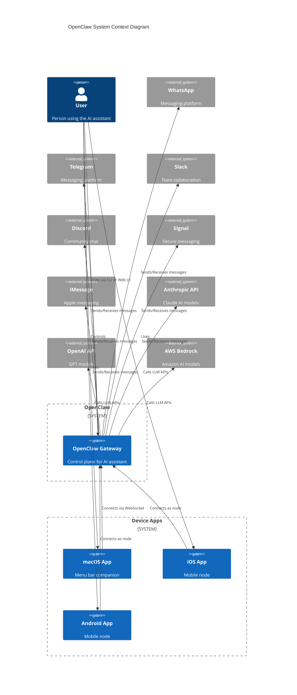

---

## C4 Container Diagram

Shows the containers (applications/data stores) that make up OpenClaw.

```mermaid
C4Container
    title OpenClaw Container Diagram
    
    Person(user, "User", "Person using the AI assistant")
    
    Container_Boundary(cli, "CLI/Web Interface") {
        Container(cli_app, "CLI Tool", "Node.js/TypeScript", "Command-line interface")
        Container(web_ui, "Web UI", "Lit/Web Components", "Browser-based control panel")
    }
    
    Container_Boundary(gateway, "OpenClaw Gateway") {
        Container(ws_server, "WebSocket Server", "Node.js/ws", "Handles all client connections")
        Container(session_mgr, "Session Manager", "TypeScript", "Manages conversation sessions")
        Container(agent_runtime, "Agent Runtime", "TypeScript/pi-agent-core", "Executes AI tasks")
        Container(channel_mgr, "Channel Manager", "TypeScript", "Manages messaging channels")
        Container(plugin_mgr, "Plugin Manager", "TypeScript", "Loads extensions")
        Container(cron, "Cron Scheduler", "TypeScript", "Scheduled tasks")
        
        ContainerDb(sessions, "Session Store", "File-based", "Conversation history")
        ContainerDb(config, "Config Store", "JSON", "User configuration")
        ContainerDb(credentials, "Credentials", "Encrypted", "API keys and tokens")
    }
    
    Container_Boundary(channels, "Channel Adapters") {
        Container(whatsapp_adapter, "WhatsApp Adapter", "TypeScript/Baileys", "WhatsApp Web integration")
        Container(telegram_adapter, "Telegram Adapter", "TypeScript/grammY", "Telegram Bot API")
        Container(slack_adapter, "Slack Adapter", "TypeScript/Bolt", "Slack integration")
        Container(discord_adapter, "Discord Adapter", "TypeScript/discord.js", "Discord bot")
    }
    
    Container_Boundary(apps, "Device Apps") {
        Container(macos_app, "macOS App", "SwiftUI", "Menu bar companion app")
        Container(ios_app, "iOS App", "SwiftUI", "Mobile node app")
        Container(android_app, "Android App", "Kotlin/Jetpack", "Mobile node app")
    }
    
    Container_Boundary(external, "External Services") {
        Container_Ext(anthropic, "Anthropic", "REST API", "Claude models")
        Container_Ext(openai, "OpenAI", "REST API", "GPT models")
    }
    
    Rel(user, cli_app, "Runs commands")
    Rel(user, web_ui, "Uses browser")
    Rel(user, macos_app, "Controls")
    
    Rel(cli_app, ws_server, "WebSocket", "ws://localhost:18789")
    Rel(web_ui, ws_server, "WebSocket", "ws://localhost:18789")
    Rel(macos_app, ws_server, "WebSocket", "ws://localhost:18789")
    Rel(ios_app, ws_server, "WebSocket", "ws://localhost:18789")
    
    Rel(ws_server, session_mgr, "Manages")
    Rel(ws_server, agent_runtime, "Invokes")
    Rel(ws_server, channel_mgr, "Routes")
    Rel(ws_server, plugin_mgr, "Uses")
    Rel(ws_server, cron, "Schedules")
    
    Rel(session_mgr, sessions, "Reads/Writes")
    Rel(ws_server, config, "Reads")
    Rel(ws_server, credentials, "Reads")
    
    Rel(channel_mgr, whatsapp_adapter, "Uses")
    Rel(channel_mgr, telegram_adapter, "Uses")
    Rel(channel_mgr, slack_adapter, "Uses")
    Rel(channel_mgr, discord_adapter, "Uses")
    
    Rel(agent_runtime, anthropic, "HTTPS/JSON")
    Rel(agent_runtime, openai, "HTTPS/JSON")
    
    UpdateLayoutConfig($c4ShapeInRow="3", $c4BoundaryInRow="1")
```

---

## Component Diagram

Detailed view of the Gateway internal components.

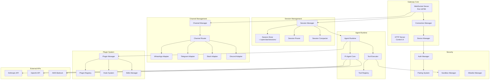

---

## Data Flow Diagrams

### Message Routing Flow

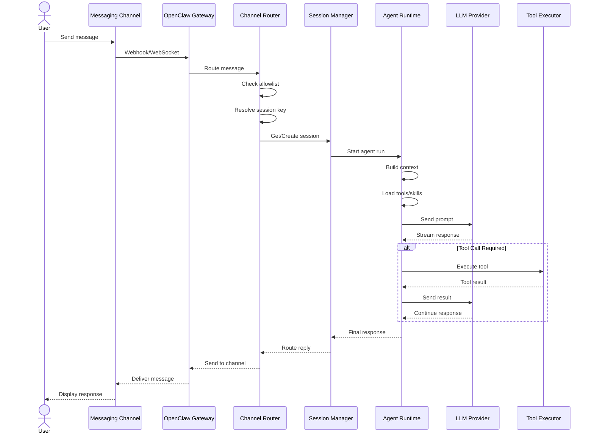

### Agent Execution Flow

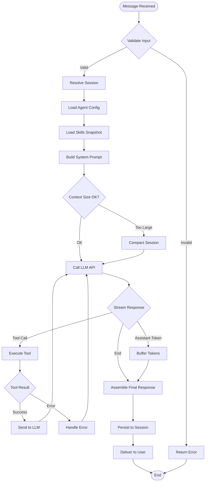

### WebSocket Connection Lifecycle

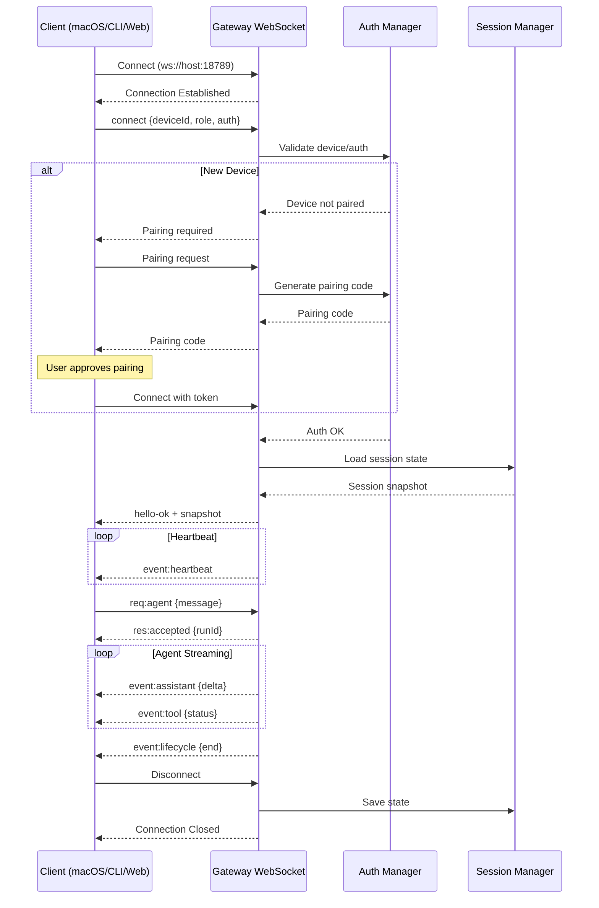

---

## Sequence Diagrams

### Tool Execution Sequence

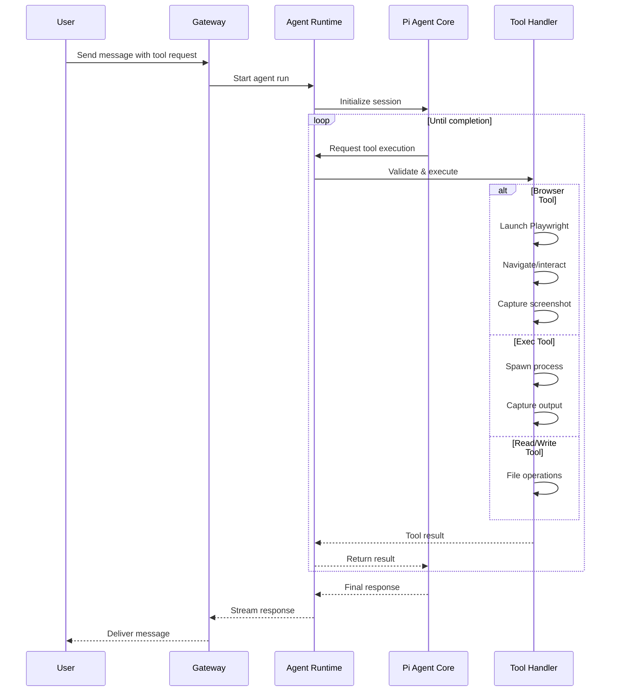

### Channel Message Handling

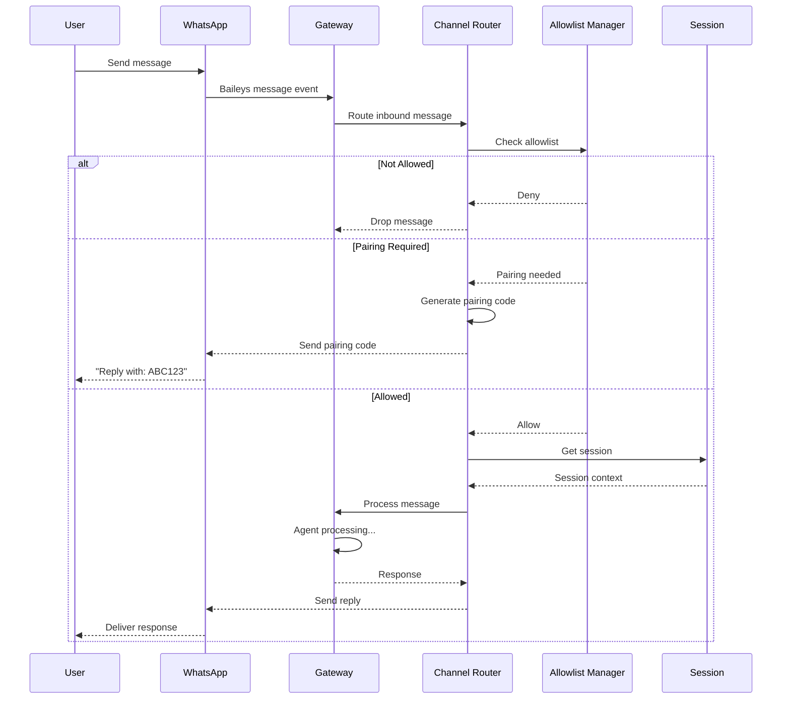

### Multi-Agent Routing

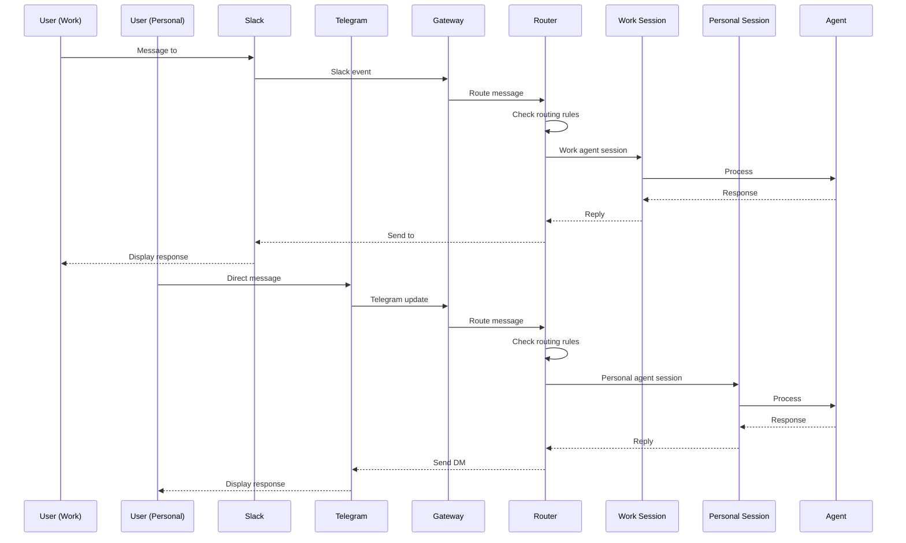

---

## Deployment Diagrams

### Local Development Deployment

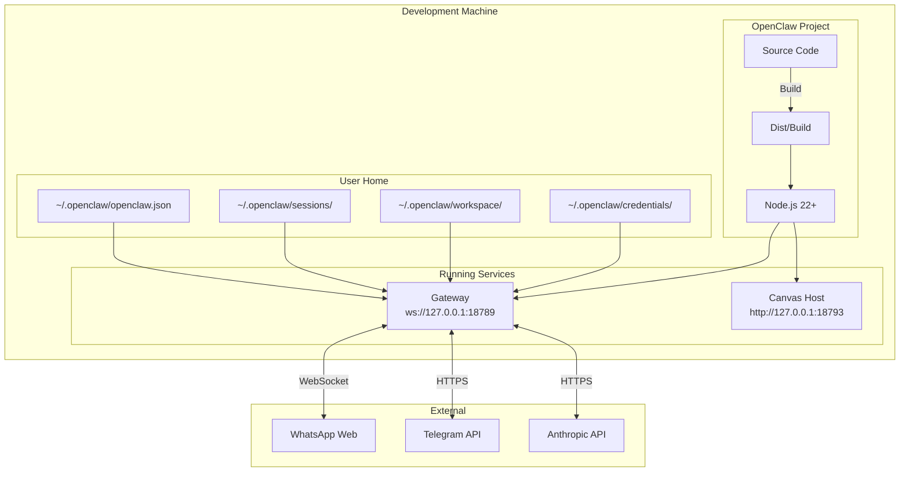

### Docker Deployment

```mermaid
graph TB
    subgraph "Docker Host"
        subgraph "OpenClaw Network"
            subgraph "openclaw-gateway Container"
                GW_APP[Gateway App]
                GW_DATA[/home/node/.openclaw]
            end
            
            subgraph "openclaw-cli Container"
                CLI[CLI Tool]
            end
        end
    end
    
    subgraph "Host Volumes"
        HOST_CONFIG[Config Dir]
        HOST_WORKSPACE[Workspace Dir]
    end
    
    subgraph "External Services"
        CHANNELS[Messaging Channels]
        LLMS[LLM Providers]
    end
    
    HOST_CONFIG -.->|Mount| GW_DATA
    HOST_WORKSPACE -.->|Mount| GW_DATA
    
    GW_APP -->|Port 18789| CHANNELS
    GW_APP -->|HTTPS| LLMS
    CLI -->|Internal| GW_APP
```

### Remote Gateway with Device Nodes

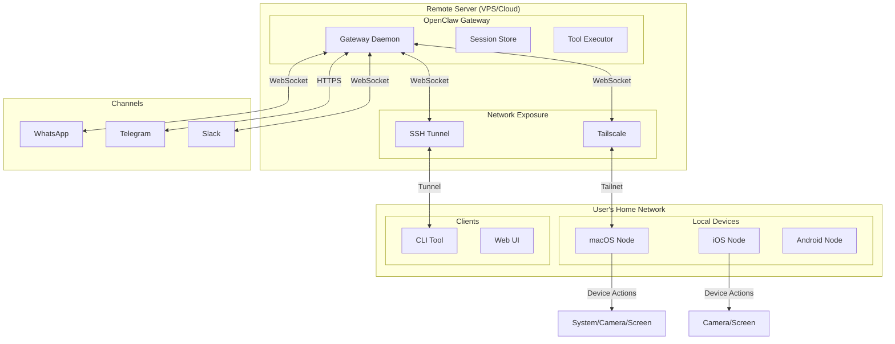

---

## State Machine Diagrams

### Session State Machine

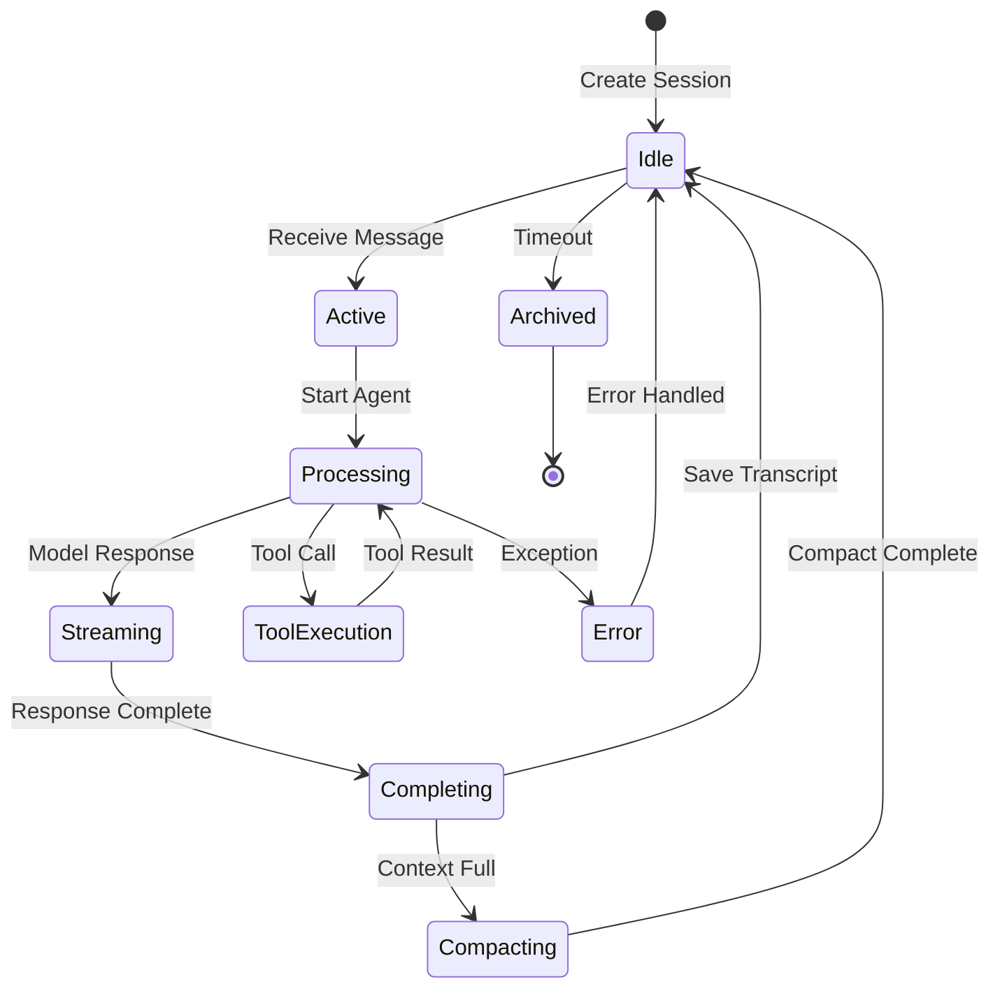

### Device Pairing State Machine

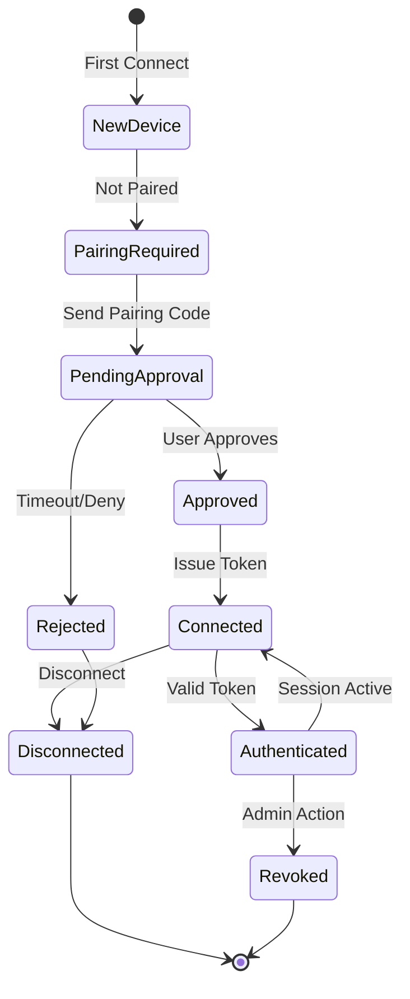

---

## Entity Relationship Diagram

### Core Data Model

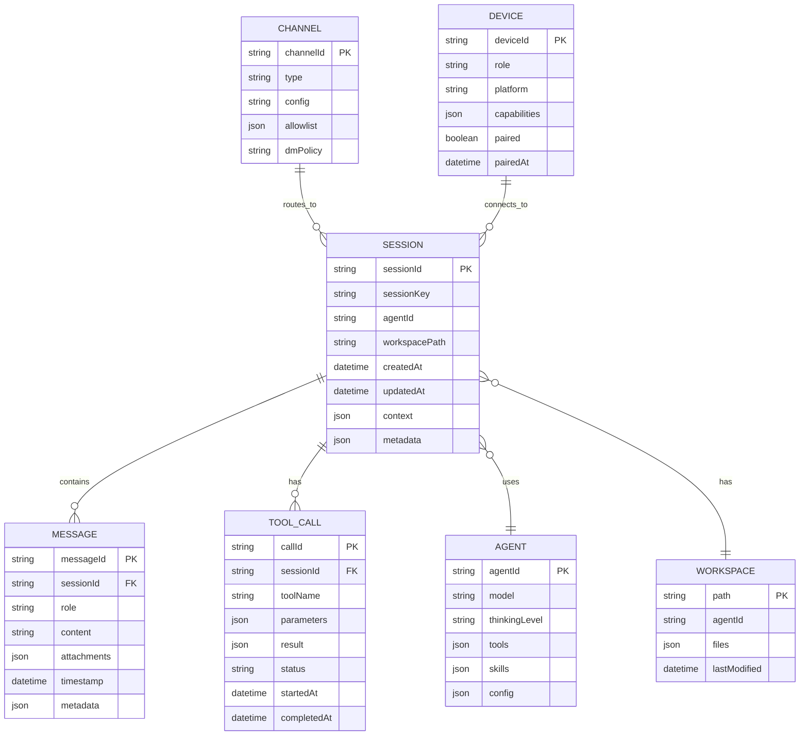

---

*Generated from source code analysis on 2026-01-31*
