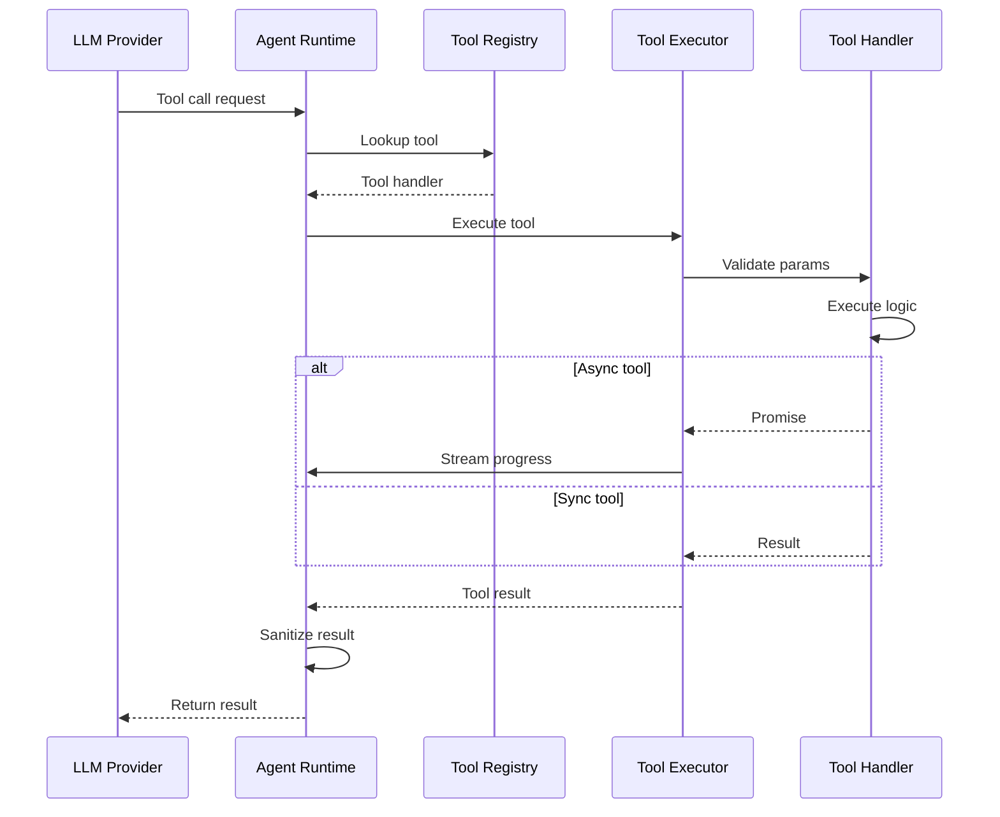
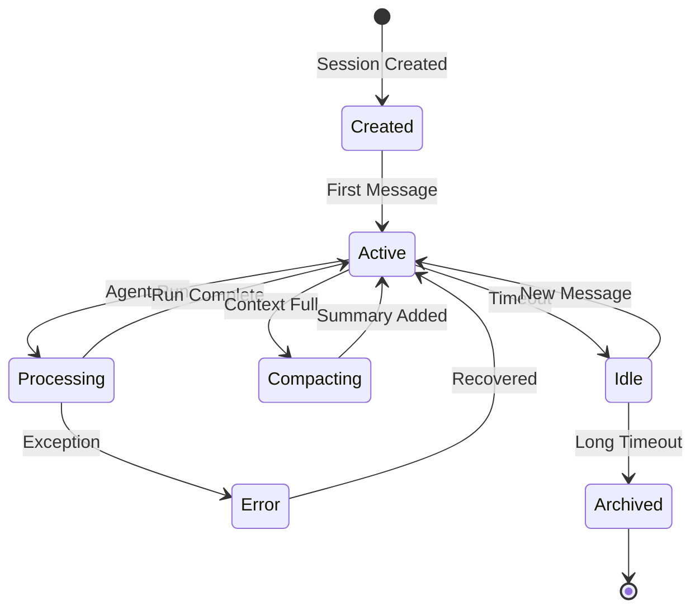

# OpenClaw Technical Documentation

## Table of Contents
1. [WebSocket Protocol](#websocket-protocol)
2. [Gateway API Reference](#gateway-api-reference)
3. [Configuration Schema](#configuration-schema)
4. [Tool System](#tool-system)
5. [Plugin API](#plugin-api)
6. [Session Management](#session-management)

---

## WebSocket Protocol

### Overview

The Gateway exposes a WebSocket API on port 18789 (configurable) for real-time bidirectional communication between clients and the Gateway.

### Connection Lifecycle

#### 1. Connect
```javascript
// Client sends as first frame
{
  "type": "connect",
  "id": "uuid-v4",
  "params": {
    "deviceId": "my-device-id",
    "role": "client",  // or "node" for device nodes
    "platform": "macos",
    "version": "2026.1.30",
    "auth": {
      "token": "optional-gateway-token"
    }
  }
}

// Gateway responds
{
  "type": "res",
  "id": "uuid-v4",
  "ok": true,
  "payload": {
    "hello": "ok",
    "snapshot": {
      "presence": { /* ... */ },
      "health": { /* ... */ }
    }
  }
}
```

#### 2. Request/Response Pattern
```javascript
// Client request
{
  "type": "req",
  "id": "uuid-v4",
  "method": "health",
  "params": {}
}

// Gateway response
{
  "type": "res",
  "id": "uuid-v4",
  "ok": true,
  "payload": {
    "status": "healthy",
    "version": "2026.1.30",
    "uptime": 3600
  }
}
```

#### 3. Server-Initiated Events
```javascript
// Gateway pushes events
{
  "type": "event",
  "event": "heartbeat",
  "payload": {
    "timestamp": "2026-01-31T12:00:00Z"
  },
  "seq": 42,
  "stateVersion": 123
}
```

### Protocol Methods

#### Core Methods

| Method | Description | Params | Response |
|--------|-------------|--------|----------|
| `health` | Get gateway health | `{}` | Health status |
| `status` | Get full status | `{}` | Channels, sessions, config |
| `send` | Send a message | `{to, message}` | Send result |
| `agent` | Run agent | `{message, sessionKey}` | `{runId, acceptedAt}` |
| `agent.wait` | Wait for agent | `{runId, timeoutMs}` | Completion status |
| `config.get` | Get config | `{}` | Full config |
| `config.patch` | Update config | `{path, value}` | Success/error |
| `sessions.list` | List sessions | `{}` | Session list |
| `sessions.history` | Get history | `{sessionId}` | Messages |
| `channels.list` | List channels | `{}` | Channel status |
| `channels.status` | Channel health | `{channel}` | Status |
| `pairing.list` | List devices | `{}` | Paired devices |
| `pairing.approve` | Approve device | `{deviceId}` | Success |
| `nodes.list` | List nodes | `{}` | Connected nodes |
| `node.invoke` | Invoke node | `{nodeId, command}` | Result |
| `cron.list` | List cron jobs | `{}` | Job list |
| `hooks.trigger` | Trigger hook | `{hook, data}` | Success |

#### Agent Streaming Events

```javascript
// Lifecycle events
{ "type": "event", "event": "agent", "payload": { "stream": "lifecycle", "phase": "start", "runId": "..." } }
{ "type": "event", "event": "agent", "payload": { "stream": "lifecycle", "phase": "end", "runId": "..." } }
{ "type": "event", "event": "agent", "payload": { "stream": "lifecycle", "phase": "error", "error": "..." } }

// Assistant streaming
{ "type": "event", "event": "agent", "payload": { "stream": "assistant", "text": "Hello...", "runId": "..." } }

// Tool events
{ "type": "event", "event": "agent", "payload": { "stream": "tool", "tool": "browser", "status": "start", "runId": "..." } }
{ "type": "event", "event": "agent", "payload": { "stream": "tool", "tool": "browser", "status": "end", "result": {...}, "runId": "..." } }
```

---

## Gateway API Reference

### REST Endpoints

In addition to WebSocket, the Gateway exposes HTTP endpoints:

#### Health Check
```http
GET /health

Response:
{
  "status": "healthy",
  "version": "2026.1.30",
  "uptime": 3600,
  "channels": {
    "whatsapp": "connected",
    "telegram": "connected"
  }
}
```

#### OpenAI-Compatible API
```http
POST /v1/chat/completions
Content-Type: application/json
Authorization: Bearer <token>

{
  "model": "claude-opus-4-5",
  "messages": [{"role": "user", "content": "Hello"}],
  "stream": true
}
```

### WebSocket Event Types

#### Presence Events
```javascript
// User/Agent presence updates
{
  "type": "event",
  "event": "presence",
  "payload": {
    "sessionId": "...",
    "status": "online|offline|typing",
    "timestamp": "..."
  }
}
```

#### Chat Events
```javascript
// Incoming messages from channels
{
  "type": "event",
  "event": "chat",
  "payload": {
    "channel": "whatsapp",
    "from": "+1234567890",
    "message": {
      "text": "Hello",
      "attachments": []
    },
    "timestamp": "..."
  }
}
```

#### System Events
```javascript
// Gateway state changes
{
  "type": "event",
  "event": "system",
  "payload": {
    "type": "config-reload",
    "timestamp": "..."
  }
}
```

---

## Configuration Schema

### Configuration File

Location: `~/.openclaw/openclaw.json`

```json5
{
  // Gateway settings
  gateway: {
    bind: "loopback",        // "loopback", "lan", "0.0.0.0"
    port: 18789,
    auth: {
      mode: "none",          // "none", "password", "token"
      token: null,
      password: null,
      allowTailscale: true,
    },
    tailscale: {
      mode: "off",           // "off", "serve", "funnel"
      resetOnExit: false,
    },
    cors: {
      origins: ["*"],
    },
  },
  
  // Agent defaults
  agents: {
    defaults: {
      model: "anthropic/claude-opus-4-5",
      thinking: "medium",    // "off", "minimal", "low", "medium", "high", "xhigh"
      verbose: false,
      workspace: "~/.openclaw/workspace",
      sandbox: {
        mode: "off",         // "off", "non-main"
        allowlist: ["bash", "process", "read", "write", "edit"],
        denylist: ["browser", "canvas", "nodes"],
      },
      bootstrapMaxChars: 20000,
      timeoutSeconds: 600,
    },
  },
  
  // Channel configurations
  channels: {
    whatsapp: {
      enabled: true,
      allowFrom: ["+1234567890"],
      groups: {
        "group-id": {
          requireMention: true,
        },
      },
    },
    telegram: {
      enabled: true,
      botToken: "${TELEGRAM_BOT_TOKEN}",
      allowFrom: ["@username"],
      groups: {
        "*": {
          requireMention: true,
        },
      },
    },
    slack: {
      enabled: true,
      botToken: "${SLACK_BOT_TOKEN}",
      appToken: "${SLACK_APP_TOKEN}",
      dm: {
        policy: "pairing",
        allowFrom: [],
      },
    },
    discord: {
      enabled: true,
      token: "${DISCORD_BOT_TOKEN}",
      dm: {
        policy: "pairing",
      },
      guilds: {
        "guild-id": {
          channels: ["channel-id"],
        },
      },
    },
    signal: {
      enabled: false,
      account: "+1234567890",
    },
    imessage: {
      enabled: false,
      allowFrom: [],
    },
  },
  
  // Model configuration
  models: {
    profiles: [
      {
        id: "default",
        provider: "anthropic",
        model: "claude-opus-4-5",
        authProfile: "anthropic-main",
      },
    ],
    failovers: [
      {
        from: "anthropic/claude-opus-4-5",
        to: "openai/gpt-4o",
        on: ["rate-limit", "error"],
      },
    ],
  },
  
  // Authentication profiles
  authProfiles: {
    "anthropic-main": {
      type: "oauth",
      provider: "anthropic",
    },
    "openai-main": {
      type: "apiKey",
      key: "${OPENAI_API_KEY}",
    },
  },
  
  // Browser settings
  browser: {
    enabled: true,
    color: "#FF4500",
    headless: false,
  },
  
  // Cron jobs
  cron: {
    jobs: [
      {
        name: "daily-summary",
        schedule: "0 9 * * *",
        command: "openclaw agent --message 'Daily summary'",
      },
    ],
  },
  
  // Logging
  logging: {
    level: "info",           // "debug", "info", "warn", "error"
    pretty: true,
    destination: "console",  // "console", "file"
  },
}
```

### Environment Variables

| Variable | Description | Example |
|----------|-------------|---------|
| `OPENCLAW_GATEWAY_TOKEN` | Global gateway auth token | `secret-token-123` |
| `OPENCLAW_CONFIG_DIR` | Config directory path | `/home/user/.openclaw` |
| `OPENCLAW_WORKSPACE_DIR` | Workspace directory path | `/home/user/.openclaw/workspace` |
| `TELEGRAM_BOT_TOKEN` | Telegram bot token | `123456:ABC...` |
| `SLACK_BOT_TOKEN` | Slack bot token | `xoxb-...` |
| `SLACK_APP_TOKEN` | Slack app token | `xapp-...` |
| `DISCORD_BOT_TOKEN` | Discord bot token | `...` |
| `CLAUDE_AI_SESSION_KEY` | Claude session key | `sk-...` |

---

## Tool System

### Built-in Tools

#### 1. bash/exec
Execute shell commands.

```javascript
{
  name: "bash",
  description: "Execute bash commands",
  parameters: {
    command: "string",      // Required
    timeout: "number",      // Optional, seconds
    cwd: "string",          // Optional, working directory
  }
}
```

#### 2. read
Read file contents.

```javascript
{
  name: "read",
  description: "Read file contents",
  parameters: {
    filePath: "string",     // Required
    offset: "number",       // Optional, line offset
    limit: "number",        // Optional, lines to read
  }
}
```

#### 3. write
Write content to file.

```javascript
{
  name: "write",
  description: "Write content to file",
  parameters: {
    filePath: "string",     // Required
    content: "string",      // Required
  }
}
```

#### 4. edit
Edit existing file.

```javascript
{
  name: "edit",
  description: "Edit file with find/replace",
  parameters: {
    filePath: "string",     // Required
    oldString: "string",    // Required
    newString: "string",    // Required
  }
}
```

#### 5. browser
Control browser via Playwright.

```javascript
{
  name: "browser",
  description: "Browser automation",
  parameters: {
    action: "string",       // "navigate", "click", "type", "snapshot"
    url: "string",          // For navigate
    selector: "string",     // For click/type
    text: "string",         // For type
  }
}
```

#### 6. message
Send messages to channels.

```javascript
{
  name: "message",
  description: "Send message to channel",
  parameters: {
    to: "string",           // Channel/Contact
    message: "string",      // Message content
    attachments: "array",   // Optional files
  }
}
```

#### 7. sessions_list
List active sessions.

```javascript
{
  name: "sessions_list",
  description: "List all sessions",
  parameters: {}
}
```

#### 8. sessions_send
Send message to another session.

```javascript
{
  name: "sessions_send",
  description: "Send message to session",
  parameters: {
    sessionId: "string",
    message: "string",
  }
}
```

### Tool Execution Flow



---

## Plugin API

### Plugin Structure

```typescript
// extensions/my-plugin/index.ts
import { definePlugin } from 'openclaw/plugin-sdk';

export default definePlugin({
  name: 'my-plugin',
  version: '1.0.0',
  
  // Plugin hooks
  hooks: {
    // Before agent starts
    async before_agent_start({ session, context }) {
      // Modify context before run
      context.systemPrompt += '\nCustom instruction';
    },
    
    // After agent completes
    async agent_end({ session, messages, metadata }) {
      // Log or process results
      console.log(`Agent completed: ${metadata.duration}ms`);
    },
    
    // Before tool execution
    async before_tool_call({ session, tool, params }) {
      // Validate or modify tool call
      if (tool === 'bash' && params.command.includes('rm -rf /')) {
        throw new Error('Dangerous command blocked');
      }
    },
    
    // After tool execution
    async after_tool_call({ session, tool, params, result }) {
      // Log tool usage
      console.log(`Tool ${tool} executed`);
    },
    
    // Transform tool result before persistence
    async tool_result_persist({ session, tool, result }) {
      // Modify result
      return result;
    },
    
    // Message received from channel
    async message_received({ session, message, channel }) {
      // Process incoming message
    },
    
    // Message being sent
    async message_sending({ session, message }) {
      // Modify outgoing message
    },
    
    // Session lifecycle
    async session_start({ session }) {
      console.log(`Session started: ${session.id}`);
    },
    
    async session_end({ session }) {
      console.log(`Session ended: ${session.id}`);
    },
    
    // Gateway lifecycle
    async gateway_start({ gateway }) {
      console.log('Gateway started');
    },
    
    async gateway_stop({ gateway }) {
      console.log('Gateway stopped');
    },
  },
  
  // Register custom tools
  tools: [
    {
      name: 'my_custom_tool',
      description: 'Custom tool description',
      parameters: {
        type: 'object',
        properties: {
          param1: { type: 'string' },
          param2: { type: 'number' },
        },
        required: ['param1'],
      },
      async execute({ params, session }) {
        // Tool logic
        return { result: 'success' };
      },
    },
  ],
  
  // Register custom channels
  channels: [
    {
      type: 'my_channel',
      async setup(config) {
        // Initialize channel connection
      },
      async send(message) {
        // Send message
      },
      async close() {
        // Cleanup
      },
    },
  ],
});
```

### Plugin Installation

```bash
# Install from npm
openclaw plugins install my-plugin

# Install from directory
openclaw plugins install ./my-plugin

# Install from git
openclaw plugins install github:user/my-plugin
```

---

## Session Management

### Session Structure

```typescript
interface Session {
  // Identification
  sessionId: string;           // Unique session ID
  sessionKey: string;          // Routing key (channel + peer)
  agentId: string;             // Associated agent
  
  // Context
  workspacePath: string;       // Workspace directory
  systemPrompt: string;        // Current system prompt
  messages: Message[];         // Conversation history
  
  // State
  status: 'idle' | 'active' | 'processing';
  metadata: SessionMetadata;
  
  // Timing
  createdAt: Date;
  updatedAt: Date;
  lastActivity: Date;
}

interface Message {
  id: string;
  role: 'user' | 'assistant' | 'system' | 'tool';
  content: string;
  attachments?: Attachment[];
  toolCalls?: ToolCall[];
  timestamp: Date;
}
```

### Session Lifecycle



### Session Storage

Sessions are persisted to disk at `~/.openclaw/sessions/`:

```
~/.openclaw/sessions/
├── <session-id-1>.jsonl
├── <session-id-2>.jsonl
└── ...
```

Each session is stored as JSON Lines (JSONL) with one message per line:

```json
{"type": "system", "content": "System prompt...", "timestamp": "2026-01-31T12:00:00Z"}
{"type": "user", "content": "Hello", "timestamp": "2026-01-31T12:00:01Z"}
{"type": "assistant", "content": "Hi there!", "timestamp": "2026-01-31T12:00:05Z"}
```

### Context Compaction

When context approaches the model's token limit:

1. **Trigger**: Token count > threshold (e.g., 80% of limit)
2. **Action**: Summarize older messages
3. **Result**: Replace summarized messages with compact summary
4. **Preserve**: Recent messages and system prompt

```javascript
// Compaction event
{
  type: 'compaction',
  fromMessage: 10,
  toMessage: 100,
  summary: 'User asked about... Assistant explained...',
  tokenReduction: 5000
}
```

---

## Security Model

### Authentication Layers

```
┌─────────────────────────────────────────┐
│         Authentication Stack            │
├─────────────────────────────────────────┤
│  1. Device Pairing (WS connect)        │
│     - Device ID validation              │
│     - Pairing code approval             │
├─────────────────────────────────────────┤
│  2. Gateway Token (optional)            │
│     - Global access token               │
│     - OPENCLAW_GATEWAY_TOKEN            │
├─────────────────────────────────────────┤
│  3. Channel Authentication              │
│     - Bot tokens (Telegram, Slack)      │
│     - OAuth (WhatsApp)                  │
├─────────────────────────────────────────┤
│  4. Model API Authentication            │
│     - API keys                          │
│     - OAuth profiles                    │
└─────────────────────────────────────────┘
```

### Sandbox Modes

| Mode | Description | Use Case |
|------|-------------|----------|
| `off` | No sandboxing | Personal/main session |
| `non-main` | Sandbox non-main sessions | Group chats, shared access |

### Allowlist System

```javascript
// Channel allowlist configuration
{
  channels: {
    whatsapp: {
      // Individual allowlist
      allowFrom: ["+1234567890", "+0987654321"],
      
      // Group configuration
      groups: {
        "group-id-1": {
          requireMention: true,
          allowFrom: ["*"]  // Allow all members
        }
      }
    }
  }
}
```

---

## Error Handling

### Error Types

| Code | Description | Recovery |
|------|-------------|----------|
| `AUTH_FAILED` | Authentication failed | Retry with valid token |
| `SESSION_NOT_FOUND` | Session doesn't exist | Create new session |
| `CHANNEL_NOT_CONNECTED` | Channel offline | Check channel config |
| `TOOL_TIMEOUT` | Tool execution timeout | Increase timeout |
| `MODEL_ERROR` | LLM API error | Retry or failover |
| `RATE_LIMITED` | Rate limit hit | Wait and retry |

### Error Response Format

```javascript
{
  type: "res",
  id: "request-id",
  ok: false,
  error: {
    code: "TOOL_TIMEOUT",
    message: "Tool execution exceeded timeout",
    details: {
      tool: "browser",
      timeout: 30000,
    }
  }
}
```

---

*Generated from source code analysis on 2026-01-31*
